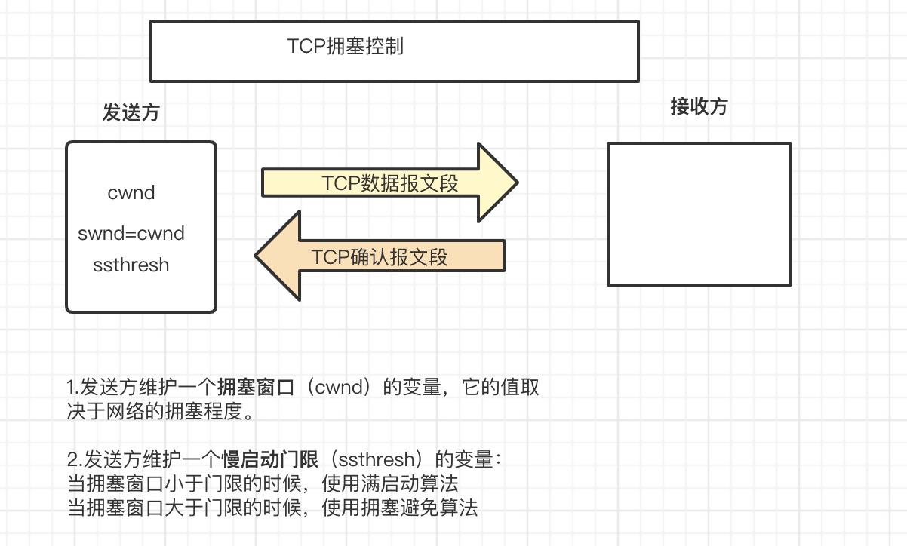

## 为什么要做拥塞控制

在前面的一章我们提到过，tcp基于不可靠的ip，要解决这样和那样的问题[tcp三次握手四次挥手](https://www.xcssuper.com/post/TCP/)，其中很重要的一个任务，就是要进行流控，我们可以把这个行为比做在规定时间内接水，在这个时间内水放太大了，那可能没到时间点水瓶就被撑破了，如果水放小了，那么可能到了时间点还没接满，如何把控水流的速率跟流量，这就是你要思考的问题。在网络的世界，如果在某个时间段，应用程序高速发包，就有可能导致路由器缓存耗尽，从而导致丢包。

拥塞控制的过程分为四个阶段：慢启动、拥塞避免、快重传和快恢复，是现有的众多拥塞控制算法的基础，下面详细说明这几个阶段。

## 拥塞避免

- 传输轮次：发送方给接收方发送数据报文段后，接收方给发送方发回相应的确认报文段，一个传输轮次所经历的时间就是往返时间RTT(RTT并非是恒定的数值），使用传输轮次是为了强调，把拥塞窗口cwnd所允许发送的报文段都连续发送出去，并收到了对已发送的最后一个报文段的确认，拥塞窗口cwnd会随着网络拥塞程度以及所使用的拥塞控制算法动态变化。
- 在tcp双方建立逻辑链接关系时， 拥塞窗口cwnd的值被设置为1，还需设置慢开始门限ssthresh,在执行慢开始算法时，发送方每收到一个对新报文段的确认时，就把拥塞窗口cwnd的值加一，然后开始下一轮的传输，当拥塞窗口cwnd增长到慢开始门限值时，就使用拥塞避免算法。

## 慢启动（也有称慢开始）

- 假设当前发送方拥塞窗口cwnd的值为1，而发送窗口swnd等于拥塞窗口cwnd，因此发送方当前只能发送一个数据报文段（拥塞窗口cwnd的值是几，就能发送几个数据报文段），接收方收到该数据报文段后，给发送方回复一个确认报文段，发送方收到该确认报文后，将拥塞窗口的值变为2，
- 发送方此时可以连续发送两个数据报文段，接收方收到该数据报文段后，给发送方一次发回2个确认报文段，发送方收到这两个确认报文后，将拥塞窗口的值加2变为4，发送方此时可连续发送4个报文段，接收方收到4个报文段后，给发送方依次回复4个确认报文，发送方收到确认报文后，将拥塞窗口加4，置为8，发送方此时可以连续发送8个数据报文段，接收方收到该8个数据报文段后，给发送方一次发回8个确认报文段，发送方收到这8个确认报文后，将拥塞窗口的值加8变为16
- 当前的拥塞窗口cwnd的值已经等于慢开始门限值，之后改用拥塞避免算法。

## 快重传

 发送方一旦收到3个连续的重复确认，就将相应的报文段立即重传，而不是等该报文段超时重传定时器超时再重传。对于个别丢失的报文段，发送方不会出现超时重传，也就不会误认为出现了拥塞，从而降低cwnd置为1的频率，使用快速重传可以提高网络的吞吐量。

- 采用快重传让发送端尽早知道发生了个别报文段的丢失
- 要求发送方尽快重传，而不是等到**重传定时器**超时才重传

## 快恢复

- 发送方一旦接受到3个连续的重复确认，就知道只是丢失了个别报文段，于是不启动慢启动算法，而执行快恢复算法。
- 发送方将门限和cwnd调整为当前窗口的一半，开始执行拥塞避免算法。

### tcp的四种拥塞控制算法

