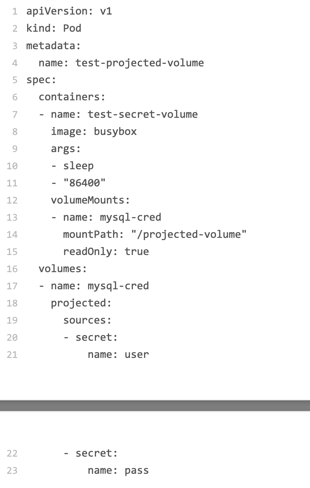
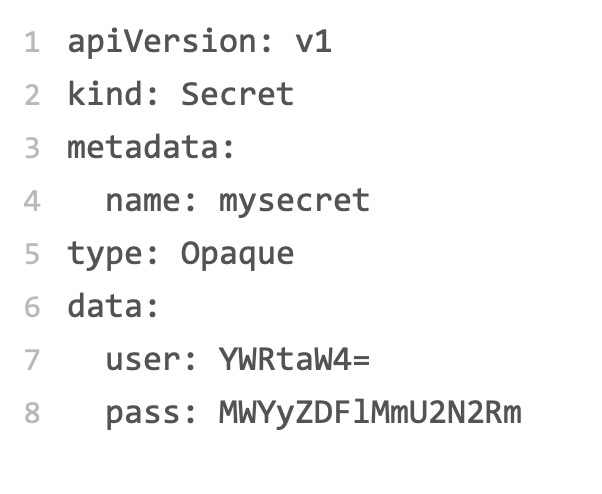
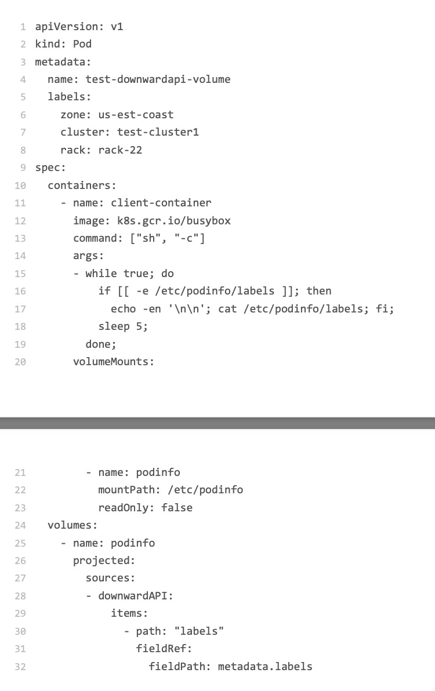

## 前言
之前我们讲到过，一个pod里面的容器共享同一个network namespace，并且可以声明共享同一个volume，那么今天我们就从一种特殊的volume开始，这种特殊的volume叫做project volueme——投射数据卷，这是kubernetes1.11之后的新特性，volueme的作用就是为容器提供预先定义好的数据。Kubernetes 支持的 Projected Volume 一共有四种:
1. Secret;
2. ConfigMap;
3. Downward API;
4. ServiceAccountToken。

## Secret
它的作用是将pod想要访问的数据放在etcd中，然后我们就可以通过在pod里面挂在volume的方式访问Secret里面保存的信息了，一个🌰：

在这个 Pod 中，我定义了一个简单的容器。它声明挂载的 Volume，并不是常见的 emptyDir 或者 hostPath 类型，而是 projected 类型。而这个 Volume 的数据来源 (sources)，则是名为 user 和 pass 的 Secret 对象，分别对应的是数据库的用户名和密 码。
我们可以通过YAML的方式来创建这个secret对象：

像这样通过挂载方式进入到容器里的 Secret，一旦其对应的 Etcd 里的数据被更新，这些 Volume 里的文件内容，同样也会被更新。其实，这是 kubelet 组件在定时维护这些 Volume。

## ConfigMap
ConfigMap其实与Secret非常类似，他与Secret的主要区别在于，ConfigMap保存的是不需要加密的应用配置，而且ConfigMap的用法几乎与Secret完全相同，我这里就不再去举例子了。

## Downward API
**它的作用是:让 Pod 里的容器能够直接获取到这个 Pod API 对象本身的信息。**
还是通过🌰来说明：

在这个 Pod 的 YAML 文件中，我定义了一个简单的容器，声明了一个 projected 类型的 Volume。只不过这次 Volume 的数据来源，变成了 Downward API。而这个 Downward API Volume，则声明了要暴露 Pod 的 metadata.labels 信息给容器。
通过这样的声明方式，当前 Pod 的 Labels 字段的值，就会被 Kubernetes 自动挂载成为 容器里的 /etc/podinfo/labels 文件。
而这个容器的启动命令，则是不断打印出 /etc/podinfo/labels 里的内容。所以，当我创建 了这个 Pod 之后，就可以通过 kubectl logs 指令，查看到这些 Labels 字段被打印出来
不过，需要注意的是，**Downward API 能够获取到的信息，一定是 Pod 里的容器进程启动 之前就能够确定下来的信息**。而如果你想要获取 Pod 容器运行后才会出现的信息，比如， 容器进程的 PID，那就肯定不能使用 Downward API 了，而应该考虑在 Pod 里定义一个 sidecar 容器。

## ServiceAccountToken
Service Account对象的作用，就是kebernetes内置的一种账户服务，它是kebernetes进行权限分配的对象，**service account的授权文件和信息，其实保存在一个特殊的Secret对象里面，这个特殊的Secret对象，成为ServiceAccountToken，任何Kebernetes集群上的应用，都必须使用ServiceAccountToken里面保存的信息，才能合法的访问Api server**，Kubernetes 其实在每个 Pod 创建的时候，自动在它的 spec.volumes 部分添加上了默认 ServiceAccountToken 的定义，然后自动给每个容器加 上了对应的 volumeMounts 字段。Kebernetes支持的project volume其实只有三中，ServiceAccountToken只不过是一种特殊的Sceret volume而已。