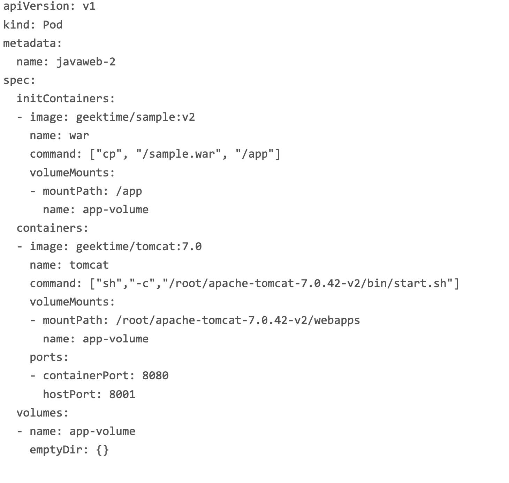

## 前言

前面我们介绍了容器的基本概念以及它的几个核心对象，今天我们重点剖析一下kebernetes的pod对象，那么什么是pod呢？前面我们提到过，pod是kebernetes中的最小调度单元， **容器的本质就是进程，通过Namespace技术做隔离，Cgroup技术做限制，rootfs做文件系统**，容器镜像就像操作系统中“.exe”的安装包，kebernetes就像操作系统，也就是说，kebernetes真正处理的是操作系统上linux容器的Namespac和Cgroup，而不存在一个pod的边界或者隔离环境。

## pod如何被创建

pod其实是一组共享了某些资源的容器，说得具体一些：**pod里的所有容器，共享同一个network namespace，并且可以声明共享同一个volume**，在 Kubernetes 项目里，Pod 的实现需要使用一个中间容器，这个容器叫作 Infra 容 器。在这个 Pod 中，Infra 容器永远都是第一个被创建的容器，而其他用户定义的容器，则 通过 Join Network Namespace 的方式，与 Infra 容器关联在一起，pod的生命周期只和Infra容器一致，与用户容器无关。

## 容器设计模式（sidcar）

一个例子：
war包与web服务器

在这个 Pod 中，我们定义了两个容器，第一个容器使用的镜像是 geektime/sample:v2，
这个镜像里只有一个 WAR 包(sample.war)放在根目录下。而第二个容器则使用的是一
个标准的 Tomcat 镜像。不过，你可能已经注意到，WAR 包容器的类型不再是一个普通容器，而是一个 Init Container 类型的容器。在 Pod 中，所有 Init Container 定义的容器，都会比 spec.containers 定义的用户容器先启动。并且，Init Container 容器会按顺序逐一启动，而直到它们都启动并且退出了，用户容器才会启动。

实际上，这个所谓的“组合”操作，正是容器设计模式里最常用的一种模式，它的名字叫:
sidecar。顾名思义，**sidecar 指的就是我们可以在一个 Pod 中，启动一个辅助容器，来完成一些独立于主进程(主容器)之外的工作****。
