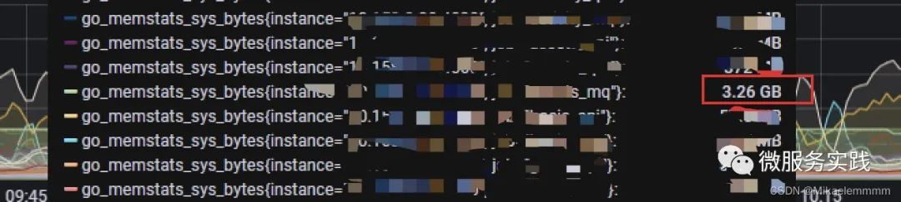
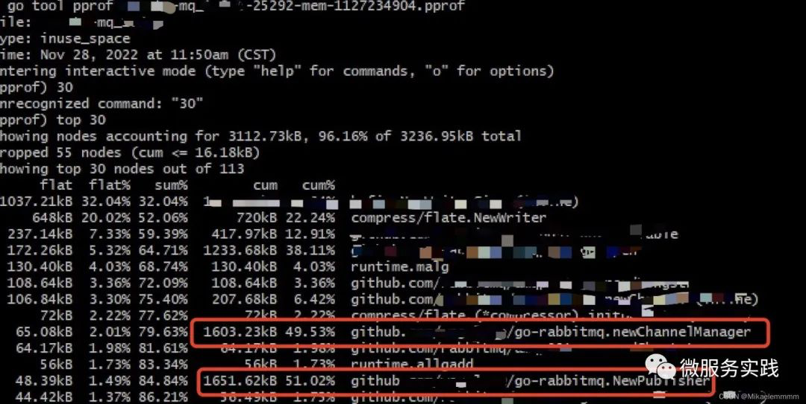

## 前沿
对于 pprof，相信熟悉 Go 语言的程序员基本都不陌生，一般线上的问题都是靠它可以快速定位。但是实际项目中，很多时候我们为了性能都不会开启它，但是出了问题又要靠它来分析。
好在 go-zero 已经帮我们很好的集成进来了，我们只需要像开关一样去开启、关闭它即可，这样我们就可以配合运维监控，当出现 cpu、内存等异常情况时候，自动开始开启收集（比如大半夜你睡的正香的时候），那么第二天可以通过分析当时的采样还原现场，那我们看看 go-zero 是如何做的。

## 源码分析
我们可以看 go-zero 源码位置 https://github.com/zeromicro/go-zero/blob/master/core/proc/signals.go
```
func init() {
  go func() {
    ...
    signals := make(chan os.Signal, 1)
    signal.Notify(signals, syscall.SIGUSR1, syscall.SIGUSR2, syscall.SIGTERM)

    for {
      v := <-signals
      switch v {
      ...
      case syscall.SIGUSR2:
        if profiler == nil {
          profiler = StartProfile()
        } else {
          profiler.Stop()
          profiler = nil
        }
      ...
    }
  }()
}
```
服务启动的时候，go-zero 在 init 初始化了监听信号操作（gracefulStop 也是通过这里通知的，这里不展开讲了），可以看到在接收到 syscall.SIGUSR2 信号时候，如果是第一次就开始收集，第二次就停止收集，看到这块可能瞬间就明白了，我们只需要在服务器执行 kill -usr2 <服务进程id> 就可以开始收集这个服务的 pprof 信息了，再执行一次就停止了收集，就可以将这些文件导出到本地，使用 go tool pprof 分析。

## 一次线上实战
我们线上有一个 mq 的服务监控告警，内存占用比较高，这时候我打开 grafana 看到服务内存累计占用的确异常，如下图：


这时候到线上找到这个服务的服务器，执行了 ps aux | grep xxx_mq，查询到了这个 mq 服务的进程 ID 是 21181，我们这时候就可以给这个 xxx_mq 服务发送信号收集 pprof 信息：kill -usr2 21181
第一次执行了这个命令后，在对应服务的 access.log 日志中可以看到 enable 了 pprof，当我们再次执行 kill -usr2 21181，access.log 日志中可以看到 disable 了 pprof 信息，这时候代表收集完成了。值得注意的是收集的信息都在 /tmp 文件夹下，以这个服务名命名的如下：
```
- xxxx-mq-cpu-xxx.pprof
- xxxx-mq-memory-xxx.pprof
- xxxx-mq-mutex-xxx.pprof
- xxxx-mq-block-xxx.pprof
- .......
```
这时候就可以下载对应的 pprof 去本地分析，可以使用 go tool pprof xxxx-mq-memory-xxx.pprof，也可以配合 graphviz 使用 web ui 查看，由于我这边通过命令行就快速定位了问题，就没用使用 web ui。
我使用 go tool pprof xxxx-**-mq-memory-xxx.pprof 然后进入命令行交互，使用 top 30 查看前面占用较高的资源。


## 写在最后
想一下 go-zero 给了我们 pprof 开关，让我们很方便的实现分析问题，但是不是所有问题都是一直存在的，比如半夜突发内存、cpu 过高，早上起来服务正常了，这怎么排查？所以我们希望如果异常了，能保留问题现场，那我们是不是可以配合运维监控实现自动保存问题现场呢？比如内存、cpu 连续超过 80% 指标3分钟的话，我们就调用这个开关收集，之后我们就可以根据这个文件来分析问题了，这样就达到自动化了。