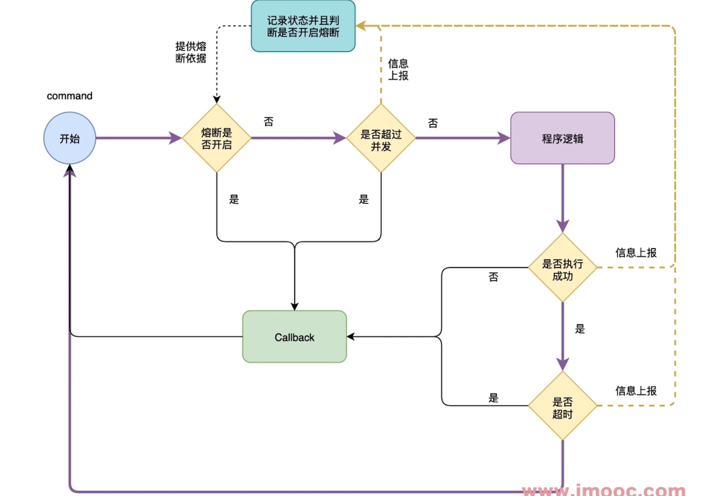
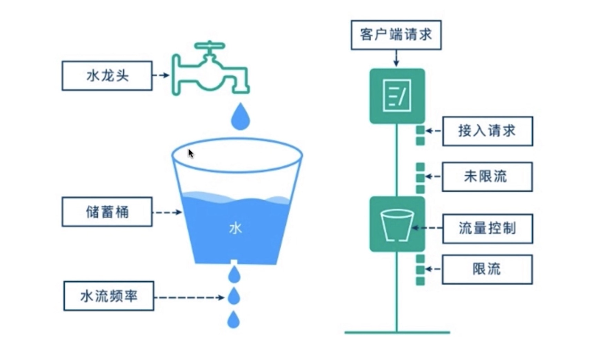

俗话说得好，微服务保稳三剑客，熔断，限流，负载均衡。
##  微服务熔断（hystrix-go）
### 什么是服务雪崩效应？
微服务之间存在互相调用，其中一个服务挂了，导致所有服务不可用，这种连锁反应，叫做服务雪崩效应
**微服务熔断（hystrix-go）的目标？**
- 阻止故障的连锁反应
- 快速失败并迅速恢复
- 回退并且优雅降级
- 提供近实时的监控与告警

** 微服务熔断（hystrix-go）使用过程的原则**
- 防止任何单独的依赖耗尽资源（线程）
- 过载立即切断并快速失败，防止排队
- 尽可能提供回退机制，保护用户免受故障
- 提供告警，确保故障及时发现

### 熔断器整体架构

### hystrix的熔断器状态
- CLOSED 关闭状态：允许流量通过
- OPEN打开状态：不允许流量通过，即处于降级状态，走降级逻辑
- HALF_OPEN状态：允许部分流量通过，如果出现超时，异常等情况，OPEN，如果成功，那么将进入CLOSED状态

### hystrix的重要字段
- Timeout：执行command的超市时间，默认时间时1000毫秒
- MaxConcurrentRequests:  最大并发量，默认值是10
- SleepWindow:  熔断器打开后多久进行再次尝试，默认值5000毫秒
- RequestVolumeThreshold:  秒内的请求量，默认值20，判断是否熔断
- ErrorPercentThreshold:  熔断百分比，默认值50%，超过启动熔断

### hystrix计数器
- 每一个Command都会有一个默认统计控制器
- 默认统计控制器 DefaultMetricCollector
- 保存熔断器的所有状态，调用次数，失败次数，被拒绝次数等信息

它会记录每秒内成功、失败、超市、拒绝的次数，当达到设置的阀值，就会启动熔断器。

## hystrix的观测面板安装

## 微服务限流（uber/limit）的作用
- 限制流量，在服务端生效
- 与熔断互补
- 保护后段服务

### 限流（uber/limit）漏桶算法原理

## 负载均衡的作用和原理
- 提高系统可扩展性

## 微服务API网关
### API网关总体架构
- 第一层 Micro api网关，可以通过统一的网关请求接口
- 第二层 聚合业务层
- 第三层 基础服务层

