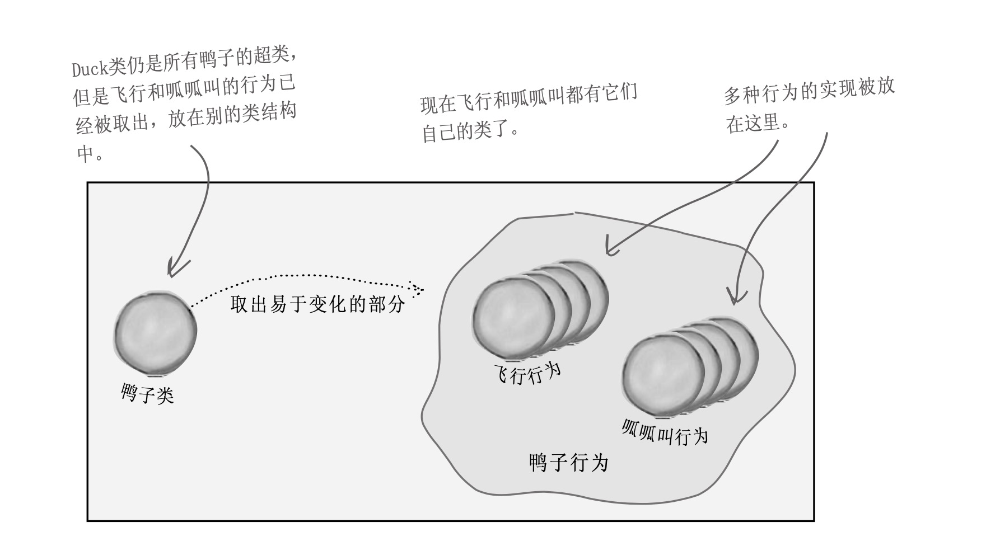

## 场景
有一套模拟鸭子的游戏。游戏中有各种鸭子，一边游泳一边呱呱叫，有的鸭子是绿头的，有的鸭子是红头的。这套系统最初的设计是这样的：
```
abstract duckBase class{
quack()
swim()
display()// 抽象
}

mallardDuck extends duckBase{
display()//重写
}
reddDuck extends duckBase{
display()//重写
}
```
但是接下来产品经理提出了需求，要做一批会飞的鸭子，我们直观的想法是给duck类新增一个fly方法，所有的鸭子继承这个类(窃喜，这也太容易了吧)...但是产品经理又说了，并不是所有的鸭子都能飞，而且我们后面的规划中可能还会增加一批橡皮鸭，木头鸭，它们不会飞，有的鸭子呱呱叫，有的鸭子吱吱叫(WTF)...

## 解决方案
继承并不能帮我们很好的解决问题，因为鸭子的行为在不断的变化，让所有的鸭子都拥有这些行为是不恰当的。那用**接口的方式**呢？似乎也不行，这样达不到代码复用的目的，这意味着你每修改或者实现一个行为，都要去相应的鸭子类修改代码。
上述问题我们不难发现，问题的核心在于**变化**二字，看到变化我们首先想到的肯定是**封装**，没错，策略模式要做的事情就是要将容易变化的部分封装起来，好让其他部分不受影响。


## 实现
- 定义duck基类，这里面实现确定不变的行为，如所有鸭子都会游泳：
```golang
package StrategyPattern

import "fmt"

type DuckBase struct {
}

func (p *DuckBase) Swim() {
	fmt.Println("all ducks can swim")
}
```
- 将容易变动的行为抽象出来
比如鸭子的叫声，有的是吱吱叫，有的是呱呱叫；鸭子飞行的方式，有的是biubiu的飞，有的是呼啦呼啦的飞。
1. 定义叫和飞两个行为接口
```golang
package StrategyPattern

type IQuackBehavior interface {
	Quack()
}

```
```golang
package StrategyPattern

type IFlyBehavior interface {
	Fly()
}
```
2. 实现鸭子两种叫声的行为
```golang
package duckBehavior

import "fmt"

type ZhizhiQuack struct {

}

func (z *ZhizhiQuack) Quack() {
	fmt.Println("鸭子吱吱吱叫")
}
```

```golang
package duckBehavior

import "fmt"

type GuaguaQuack struct {

}

func (p *GuaguaQuack) Quack() {
	fmt.Println("鸭子呱呱叫")
}
```
3. 实现鸭子两种飞行的行为
```golang
package duckBehavior

import "fmt"

type BiuFly struct {

}

func (p *BiuFly) Fly()  {
	fmt.Println("biu biu biu 飞走了")
}
```

```golang
package duckBehavior

import "fmt"

type HulaFly struct {

}

func (p *HulaFly) Fly()  {
	fmt.Println("Hu la 飞走了")
}
```

4. 模拟一个具体的鸭子
```golang
package duckObj

import "head_first/StrategyPattern"

type MiniDuckSimulator struct {
	StrategyPattern.IFlyBehavior
	StrategyPattern.IQuackBehavior
	StrategyPattern.DuckBase
}

func (p *MiniDuckSimulator) SetQuackBehavior(quack StrategyPattern.IQuackBehavior)  {
	p.IQuackBehavior = quack
}

func (p *MiniDuckSimulator) SetFlyBehavior(fly StrategyPattern.IFlyBehavior)  {
	p.IFlyBehavior = fly
}
```
5. 测试用例
```golang
  strategy := new(duckObj.MiniDuckSimulator)
	strategy.SetQuackBehavior(&duckBehavior.ZhizhiQuack{})
	strategy.SetFlyBehavior(&duckBehavior.BiuFly{})
	strategy.Quack()
	strategy.Fly()
	strategy.Swim()

	strategy.SetQuackBehavior(&duckBehavior.GuaguaQuack{})
	strategy.SetFlyBehavior(&duckBehavior.HulaFly{})
	strategy.Quack()
	strategy.Fly()
	strategy.Swim()
```

6. 测试结果
```
鸭子吱吱吱叫
biu biu biu 飞走了
all ducks can swim
鸭子呱呱叫
Hu la 飞走了
all ducks can swim
```

## 总结
- 优点：
1. 策略模式提供了管理相关的算法族的办法。策略类的等级结构定义了一个算法或行为族。恰当使用继承可以把公共的代码转移到父类里面，从而避免重复的代码。
2. 避免使用多重条件转移语句，如if...else...语句、switch 语句。
3. 每个算法单独封装，减少了算法和算法调用者的耦合。

- 缺点：
1. 策略模式只适用于客户端知道所有的算法或行为的情况。
2. 策略模式造成很多的策略类，每个具体策略类都会产生一个新类。不过可以使用享元模式来减少对象的数量。


