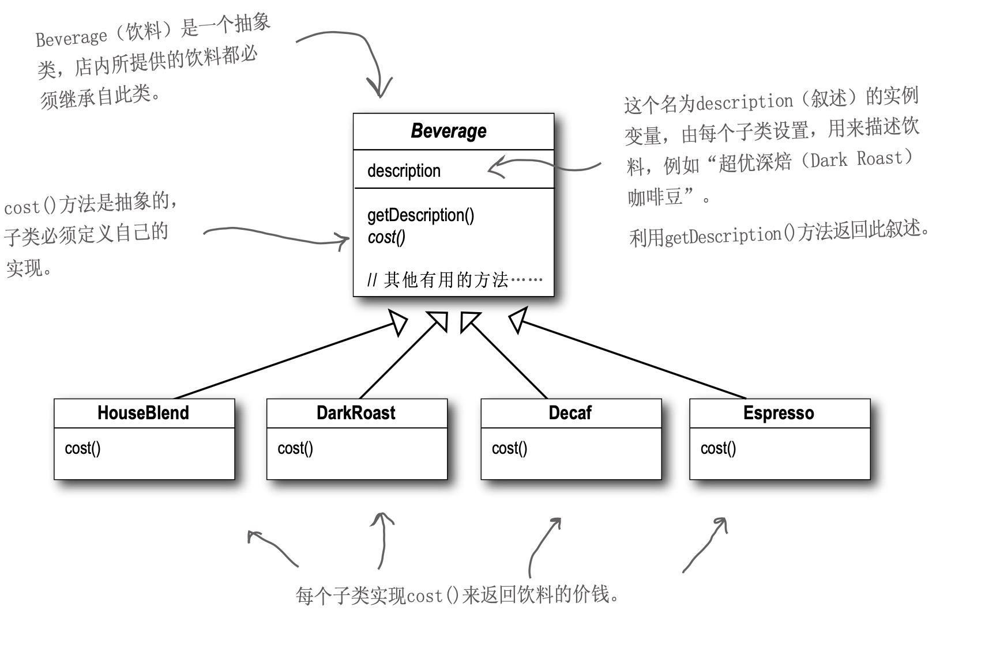

建议在读完观察者模式之后阅读本章^_^
## 场景
要设计一款奶茶店订单系统，每款奶茶可以加各种配料，比如奶泡，摩卡之类的，我们拿到需求后第一反应设计可能是这样的：


可以看到，我们的配料可能是无穷无尽的，那我们怎么样维护这些类呢？如果说某一个配料的价格变动了怎么办呢？

## 一个重要的设计原则
开放-关闭原则——类应该对扩展开放，对修改关闭。
听起来好像有点矛盾，通俗的解释一下就是说，用户在不该动现有代码的原则下，对现有功能进行扩展！

## 定义
装饰者模式动态地将责任附加到对象上。 若要扩展功能，装饰者提供了比继承更有弹性的替代方案。
装饰真模式有以下特点：
1. 装饰者和被装饰对象有相同的超类型。
2. 你可以用一个或多个装饰者包装一个对象。
3. 既然装饰者和被装饰对象有相同的超类型，所以在任何需要原始对象(被包装的)的场合， 可以用装饰过的对象代替它。
4. 装饰者可以在所委托被装饰者的行为之前与/或之后，加上自己的行为，以达到特定的目的。
5. 对象可以在任何时候被装饰，所以可以在运行时动态地、不限量地用你喜欢的装饰者来装饰
对象。

## 实现
回到具体的场景，客户需要某种饮料，可能需要加奶泡，加摩卡，那我们就将奶泡，摩卡封装成具体的对象，来装饰饮料对象。
- 定义统一的接口
```golang
package decoratorPattern

type IObeverage interface {
	GetDescription() string
	Cost() float32
}
```
- 定义饮料类
```golang
package obeverage

type Coffee struct {
	Name string
}

func (c *Coffee) GetDescription() string {
	return c.Name
}

func (c *Coffee) Cost() float32 {
	return 10.23
}
```

- 定义具体的装饰器
这里我们定义两个装饰器：摩卡和奶泡
```golang
package decorator

import "head_first/decoratorPattern"
//摩卡装饰器
type Mocha struct {
	Obeverage decoratorPattern.IObeverage
}

func (m *Mocha) GetDescription() string {
	return m.Obeverage.GetDescription() + ",mocha"
}

func (m *Mocha) Cost() float32 {
	return m.Obeverage.Cost() + 15
}
```
```golang
package decorator

import "head_first/decoratorPattern"

//奶泡装饰器
type Whip struct {
	Obeverage decoratorPattern.IObeverage
}

func (w *Whip) GetDescription() string {
	return w.Obeverage.GetDescription() + ",Whip"
}

func (w *Whip) Cost() float32 {
	return w.Obeverage.Cost() + 20.0
}
```

- 测试用例
```golang
  coffee := &obeverage.Coffee{Name: "US coffee"}
	whip := &decorator.Whip{
		Obeverage: coffee,
	}
	mocha := &decorator.Mocha{
		Obeverage: whip,
	}
	fmt.Println(mocha.GetDescription())
	fmt.Println(mocha.Cost())
```

- 测试结果
```golang
US coffee,Whip,mocha
45.23
```
## 总结
- 优点：
1. 装饰模式满足“开-闭原则”。不必修改具体组件，就可以增加新的针对该组件的具体装饰。
2. 可以使用多个具体装饰来装饰具体组件的实例。
3. 被装饰者和装饰者是弱耦合关系，由于装饰依赖于抽象组件，因此具体装饰只知道它要它要装饰的对象是抽象组件的某一个子类的实例，但不需要知道具体是哪一个具体的实例。
- 缺点：
1. 大量的装饰器，增加代码的复杂程度，因此，装饰者模式经常需要结合工厂模式来使用。
2. 多层装饰比较复杂。


