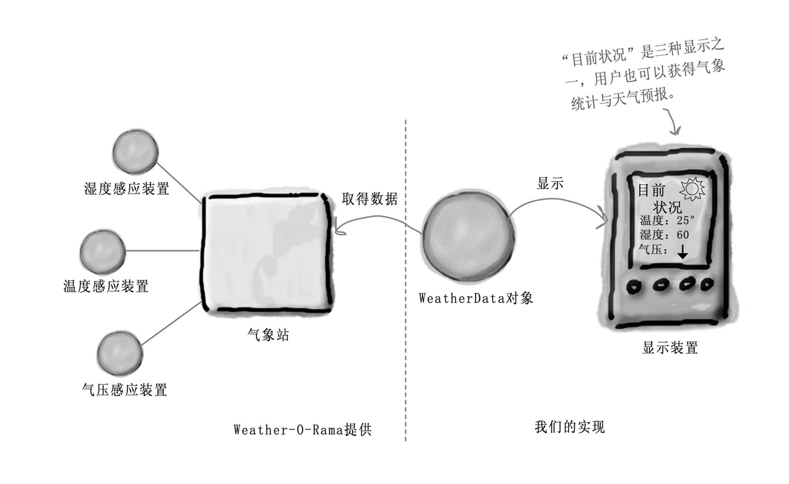
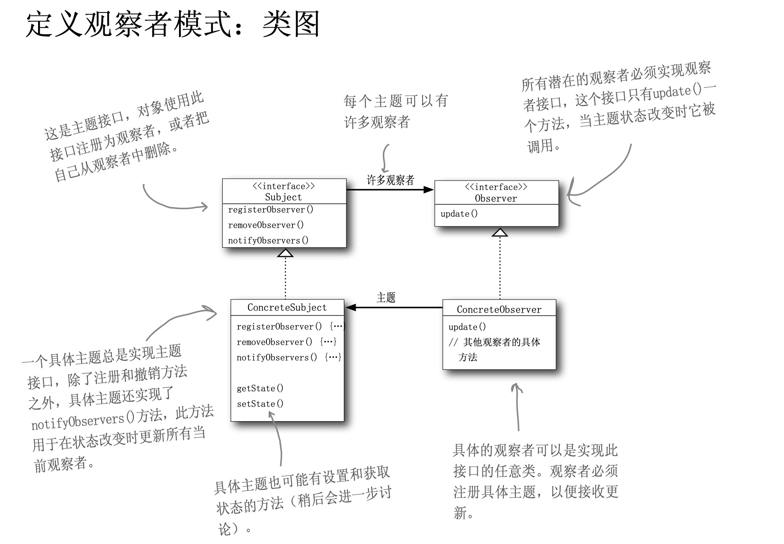

废话不多说，直接进入场景。

## 场景

我们的工作就是建立一个应用，利用WeatherData对 象取得数据，并更新三个布告板:目前状况、气象统计和天气预报。

## 定义
观察者模式定义了对象之间的一对多依赖，这 样一来，当一个对象改变状态时，它的所有依赖者都 会收到通知并自动更新。


## 实现
1. 定义主题接口
```golang
package subject

import "head_first/observerPattern/observer"

type ISubject interface {
	RegisterObserver(o observer.IObserver)
	RemoveObserver(o observer.IObserver)
	NotifyObserver()
}
```
2. 实现主题接口
```golang
package subject

import (
	"head_first/observerPattern/observer"
	"reflect"
)

type Subject struct {
	observer []observer.IObserver
}

func (s *Subject) RegisterObserver(observer observer.IObserver) {
	s.observer = append(s.observer, observer)
}

func (s *Subject) RemoveObserver(o observer.IObserver) {
	for k,v := range s.observer {
		if reflect.DeepEqual(v,o) {
			s.observer = append(s.observer[:k], s.observer[k+1:]...)
		}
	}
}

func (s *Subject) NotifyObserver() {
	for _, o := range s.observer {
		o.Update()
	}
}
```
3. 定义观察者接口
```golang
package observer

type IObserver interface {
	Update()
}
```

4. 温度、湿度、气压实现观察者接口
```golang
package observer

import "fmt"

type Temperature struct {
}

func (t *Temperature) Update() {
	fmt.Println("今天最高温度30摄氏度，最低温度18摄氏度")
}
```

```golang
package observer

import "fmt"

type Humidity struct {
}

func (h *Humidity) Update() {
	fmt.Println("湿度：60")
}
```

```golang
package observer

import "fmt"

type Pressure struct {
}

func (p *Pressure) Update() {
	fmt.Println("高层大气压1000千帕")
}
```

5. 应用调用
```golang
package main

import (
	"head_first/observerPattern/observer"
	subject2 "head_first/observerPattern/subject"
)

func main()  {
	subject := new(subject2.Subject)
	humidity := observer.Humidity{}
	pressure := observer.Pressure{}
	temperature := observer.Temperature{}

	subject.RegisterObserver(&humidity)
	subject.RegisterObserver(&pressure)
	subject.RegisterObserver(&temperature)


	subject.RemoveObserver(&humidity)
	subject.NotifyObserver()
}
```

## 总结
- 优点：
1. 第一、观察者模式在被观察者和观察者之间建立一个抽象的耦合。被观察者角色所知道的只是一个具体观察者列表，每一个具体观察者都符合一个抽象观察者的接口。被观察者并不认识任何一个具体观察者，它只知道它们都有一个共同的接口。
由于被观察者和观察者没有紧密地耦合在一起，因此它们可以属于不同的抽象化层次。如果被观察者和观察者都被扔到一起，那么这个对象必然跨越抽象化和具体化层次。
2. 观察者模式支持广播通信。被观察者会向所有的登记过的观察者发出通知。

- 缺点：
1. 如果一个被观察者对象有很多直接和间接的观察者的话，将所有的观察者都通知到会花费很多时间。
2. 虽然观察者模式可以随时使观察者知道所观察的对象发生了变化，但是观察者 模式没有相应的机制使观察者知道被观察的对象是怎么发生变化的。

