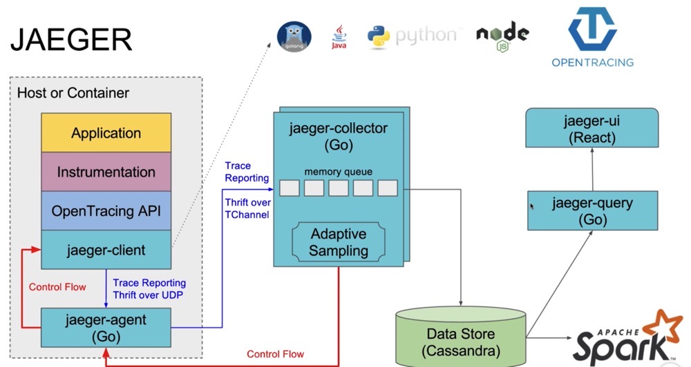

## 链路追踪作用和特性
如果你不能度量它，你就不能改进他，链路追踪就是用来度量为服务调用链，只有你观测到他的调用关系，延时等，你才能知道微服务如何改进和排查问题。 一般用来分析依赖关系，辅助性能优化。

## jaeger主要特性
- 高扩展性
- 原生支持OpenTracing
- 可观察性

## 什么是SPAN
- jaeger重的工作单元
- 包括span的名称，开始和持续时间
- 嵌套排序，建立因果关系

## 组建——工作原理
- Jaeger-client(客户端)
- Agent （客户端代理）
- Collector (数据收集处理)
- Data Store（数据存储，可换成自己想要的）
- UI


## 安装
```
docker pull jaegertracing/all-in-one:latest

docker run -d --name jaeger -e COLLECTOR_ZIPKIN_HTTP_PORT=9411 -p 5775:5775/udp -p 6831:6831/udp -p 6832:6832/udp -p 5778:5778 -p 16686:16686 -p 14268:14268 -p 9411:9411 jaegertracing/all-in-one:latest
```
- 16686 端口用于对外查询